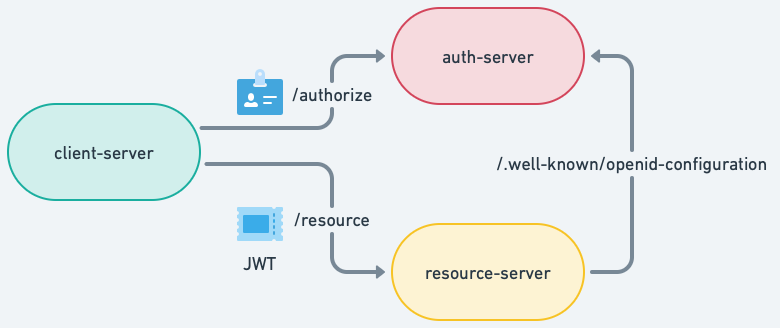

<h1 align="center">
  
</h1>

  <a href="#-tecnologias">Tecnologias</a>&nbsp;&nbsp;&nbsp;|&nbsp;&nbsp;&nbsp;
  <a href="#-projeto">Projeto</a>&nbsp;&nbsp;&nbsp;|&nbsp;&nbsp;&nbsp;
  <a href="#-roteiro">Roteiro</a>&nbsp;&nbsp;&nbsp;|&nbsp;&nbsp;&nbsp;
  <a href="#-como-executar">Como executar</a>&nbsp;&nbsp;&nbsp;|&nbsp;&nbsp;&nbsp;

 
 

<h2 align="center">
  
</h2>

 

## ✨ Tecnologias

Esse projeto foi desenvolvido com as seguintes tecnologias:

- [Spring Authorization Server](https://spring.io/projects/spring-authorization-server)
- [Spring Boot](https://spring.io/projects/spring-boot)
- [Spring Security](https://spring.io/projects/spring-security)

## 💻 Projeto

Esse projeto foi elaborado [nesse vídeo](https://youtu.be/hgLKOPHfuis) que demonstra como funciona o Spring Authorization Server e como utilizá-lo para autorizar requisições seguindo o Oauth 2.0 e OpenID Connect.

## 🗒️ Roteiro

- [ ] Arquitetura do sistema
- [ ] spring-auth-server
- [ ] client-server
- [ ] resource-server

## 🚀 Como executar

- Clone o repositório
- Abra em qualquer IDE Java
- Execute o projeto Spring Boot

Agora você pode testar os seguintes fluxos seguindo a implementação do OIDC:

- Acesse `http://localhost:8080/home`
- Autentique com o usuário `user` e senha `password`
- Aceite as opções de consentimento
- Visualize os dados gerados pelo AS (access token, refresh token e id token)
- Acesse `http://localhost:8080/tasks`
- Visualize as tarefas do usuário logado

---
